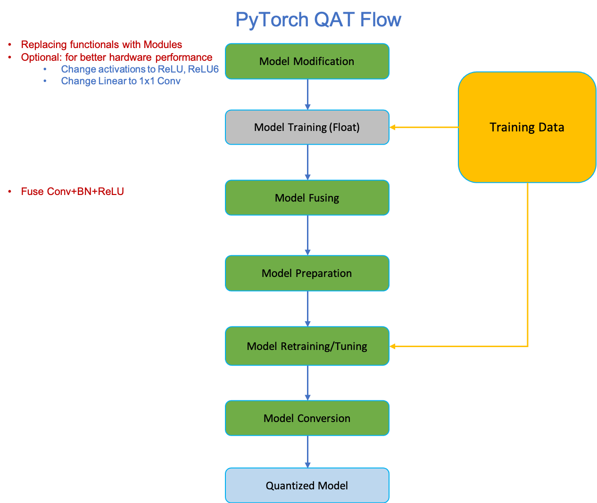
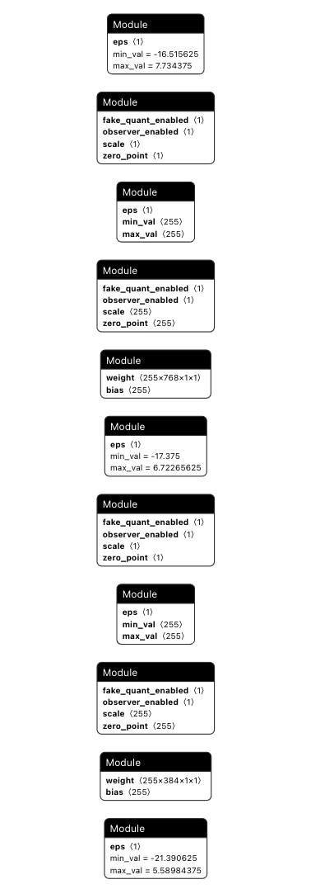

# Yolov5 Quantization Aware Training QAT

## Notes

**This repo is based on the release v7.0 of [yolov5](https://github.com/ultralytics/yolov5/).**

**This repo cloned PyTorch torch.ao source code package here (v1.13.0, except torch.ao.sparisity) and modified it as bst.torch.ao**

## 1 Setup

### 1.1 Clone the Sample  
```
git clone https://github.com/cshbli/yolov5_qat.git
```  

### 1.2 Dataset Preparation

Download the labels and images of coco2017, and unzip to the same level directory as the current project. 

```
Projects
├──datasets
|   └── coco                 # Directory for datasets 
│       ├── annotations
│       │   └── instances_val2017.json
│       ├── images
│       │   ├── train2017
│       │   └── val2017
│       ├── labels
│       │   ├── train2017
│       │   └── val2017
│       ├── train2017.txt
│       └── val2017.txt
└── yolov5_qat               # Quantization source code 
```

```
wget https://github.com/ultralytics/yolov5/releases/download/v1.0/coco2017labels.zip         # Download the labels needed
wget http://images.cocodataset.org/zips/train2017.zip
wget http://images.cocodataset.org/zips/val2017.zip
wget http://images.cocodataset.org/annotations/annotations_trainval2017.zip
```  

### 1.3 Download Yolov5m Pretrained Model  

```bash
$ cd /Projects/yolov5_qat
$ cd weights
$ wget https://github.com/ultralytics/yolov5/releases/download/v7.0/yolov5m.pt
$ cd ..
```  

#### Check this pretrained model accuracy

```
python val.py --weights weights/yolov5m.pt --data coco.yaml
```

Outputs: 
```
 Average Precision  (AP) @[ IoU=0.50:0.95 | area=   all | maxDets=100 ] = 0.452
 Average Precision  (AP) @[ IoU=0.50      | area=   all | maxDets=100 ] = 0.644
 Average Precision  (AP) @[ IoU=0.75      | area=   all | maxDets=100 ] = 0.489
 Average Precision  (AP) @[ IoU=0.50:0.95 | area= small | maxDets=100 ] = 0.278
 Average Precision  (AP) @[ IoU=0.50:0.95 | area=medium | maxDets=100 ] = 0.504
 Average Precision  (AP) @[ IoU=0.50:0.95 | area= large | maxDets=100 ] = 0.581
 Average Recall     (AR) @[ IoU=0.50:0.95 | area=   all | maxDets=  1 ] = 0.354
 Average Recall     (AR) @[ IoU=0.50:0.95 | area=   all | maxDets= 10 ] = 0.581
 Average Recall     (AR) @[ IoU=0.50:0.95 | area=   all | maxDets=100 ] = 0.632
 Average Recall     (AR) @[ IoU=0.50:0.95 | area= small | maxDets=100 ] = 0.451
 Average Recall     (AR) @[ IoU=0.50:0.95 | area=medium | maxDets=100 ] = 0.689
 Average Recall     (AR) @[ IoU=0.50:0.95 | area= large | maxDets=100 ] = 0.777
```

### 1.4 Replacing SiLU with ReLU (Optional)

- Make sure to change the learning rate, otherwise it will long time to converge.
  - We use a new hyps yaml here [hyp.m-relu-tune.yaml](./hyp.m-relu-tune.yaml). It is based on `hyp.scratch-low.yaml`, changed lr to smaller value.
    ```
    lr0: 0.001  # initial learning rate (SGD=1E-2, Adam=1E-3), changed from 0.01
    lrf: 0.001  # final OneCycleLR learning rate (lr0 * lrf), changed from 0.01
    ...
    warmup_bias_lr: 0.01  # warmup initial bias lr, changed from 0.1
    ...
    ```
- Disable GIT info checking
- Once we changed the default_act to ReLU, we can't use auto batch size anymore. 
    - We need specifiy the `batch-size`
    - Also we can change the default `batch-size` from 16 to 64

It takes a long time to complete the retraining, please be patient.

```
python train.py --data coco.yaml --epochs 50 --weights weights/yolov5m.pt --hyp data/hyps/hyp.m-relu-tune.yaml --batch-size 64
```

```
      Epoch    GPU_mem   box_loss   obj_loss   cls_loss  Instances       Size
       0/49      6.16G    0.04115    0.06202    0.01698        150        640: 100%|██████████| 1849/1849 [51:50<00:00,  1.68s/it]
                 Class     Images  Instances          P          R      mAP50   mAP50-95: 100%|██████████| 40/40 [01:26<00:00,  2.17s/it]
                   all       5000      36335      0.701      0.557      0.609      0.416
    
      Epoch    GPU_mem   box_loss   obj_loss   cls_loss  Instances       Size
      13/49      10.2G    0.03954    0.05978    0.01563        198        640: 100%|██████████| 1849/1849 [51:32<00:00,  1.67s/it]
                 Class     Images  Instances          P          R      mAP50   mAP50-95: 100%|██████████| 40/40 [01:25<00:00,  2.13s/it]
                   all       5000      36335      0.709      0.567      0.617      0.428

      Epoch    GPU_mem   box_loss   obj_loss   cls_loss  Instances       Size
      14/49      10.2G    0.03948    0.05968    0.01557        240        640: 100%|██████████| 1849/1849 [51:30<00:00,  1.67s/it]
                 Class     Images  Instances          P          R      mAP50   mAP50-95: 100%|██████████| 40/40 [01:25<00:00,  2.13s/it]
                   all       5000      36335      0.708      0.568      0.618      0.429

      Epoch    GPU_mem   box_loss   obj_loss   cls_loss  Instances       Size
      19/49      10.2G    0.03922    0.05922    0.01519        162        640: 100%|██████████| 1849/1849 [51:23<00:00,  1.67s/it]
                 Class     Images  Instances          P          R      mAP50   mAP50-95: 100%|██████████| 40/40 [01:25<00:00,  2.13s/it]
                   all       5000      36335      0.713      0.567       0.62       0.43

      Epoch    GPU_mem   box_loss   obj_loss   cls_loss  Instances       Size
      20/49      10.2G    0.03911    0.05934    0.01513        228        640: 100%|██████████| 1849/1849 [51:33<00:00,  1.67s/it]
                 Class     Images  Instances          P          R      mAP50   mAP50-95: 100%|██████████| 40/40 [01:25<00:00,  2.13s/it]
                   all       5000      36335      0.707      0.569      0.619      0.431
```

Here is the complete retraining log file [retraining after replacing SiLU with ReLU](./notes/relu_retraining.csv).

Assuming the retraining result folder name is changed to **relu**, run validation test:

```
python val.py --weights runs/train/relu/weights/best.pt --data coco.yaml

```

We will get the following validation results: 

```
 Average Precision  (AP) @[ IoU=0.50:0.95 | area=   all | maxDets=100 ] = 0.434
 Average Precision  (AP) @[ IoU=0.50      | area=   all | maxDets=100 ] = 0.625
 Average Precision  (AP) @[ IoU=0.75      | area=   all | maxDets=100 ] = 0.468
 Average Precision  (AP) @[ IoU=0.50:0.95 | area= small | maxDets=100 ] = 0.263
 Average Precision  (AP) @[ IoU=0.50:0.95 | area=medium | maxDets=100 ] = 0.484
 Average Precision  (AP) @[ IoU=0.50:0.95 | area= large | maxDets=100 ] = 0.567
 Average Recall     (AR) @[ IoU=0.50:0.95 | area=   all | maxDets=  1 ] = 0.344
 Average Recall     (AR) @[ IoU=0.50:0.95 | area=   all | maxDets= 10 ] = 0.563
 Average Recall     (AR) @[ IoU=0.50:0.95 | area=   all | maxDets=100 ] = 0.613
 Average Recall     (AR) @[ IoU=0.50:0.95 | area= small | maxDets=100 ] = 0.437
 Average Recall     (AR) @[ IoU=0.50:0.95 | area=medium | maxDets=100 ] = 0.663
 Average Recall     (AR) @[ IoU=0.50:0.95 | area= large | maxDets=100 ] = 0.767
Results saved to runs/val/exp
```

### 1.5 Replacing SiLU with ReLU6 (Optional)

Similar as replacing SiLU with ReLU

```
python train.py --data coco.yaml --epochs 50 --weights weights/yolov5m.pt --hyp data/hyps/hyp.m-relu-tune.yaml --batch-size 64
```

Assuming the retraining result folder name is changed to **relu6**, run validation test:

```
python val.py --weights runs/train/relu6/weights/best.pt --data coco.yaml

```

We will get the following validation results: 

```
Fusing layers... 
Model summary: 212 layers, 21172173 parameters, 0 gradients, 48.9 GFLOPs
val: Scanning /home/hongbing/Projects/datasets/coco/val2017.cache... 4952 images, 48 backgrounds, 0 corrupt: 100%|██████████| 5000/5000 [00:00<?, ?it/s]
                 Class     Images  Instances          P          R      mAP50   mAP50-95: 100%|██████████| 157/157 [01:15<00:00,  2.07it/s]
                   all       5000      36335      0.701      0.563      0.615      0.428
Speed: 0.1ms pre-process, 10.1ms inference, 0.9ms NMS per image at shape (32, 3, 640, 640)

Evaluating pycocotools mAP... saving runs/val/exp3/best_predictions.json...
loading annotations into memory...
Done (t=0.29s)
creating index...
index created!
Loading and preparing results...
DONE (t=3.26s)
creating index...
index created!
Running per image evaluation...
Evaluate annotation type *bbox*
DONE (t=46.18s).
Accumulating evaluation results...
DONE (t=10.45s).
 Average Precision  (AP) @[ IoU=0.50:0.95 | area=   all | maxDets=100 ] = 0.431
 Average Precision  (AP) @[ IoU=0.50      | area=   all | maxDets=100 ] = 0.621
 Average Precision  (AP) @[ IoU=0.75      | area=   all | maxDets=100 ] = 0.467
 Average Precision  (AP) @[ IoU=0.50:0.95 | area= small | maxDets=100 ] = 0.260
 Average Precision  (AP) @[ IoU=0.50:0.95 | area=medium | maxDets=100 ] = 0.484
 Average Precision  (AP) @[ IoU=0.50:0.95 | area= large | maxDets=100 ] = 0.559
 Average Recall     (AR) @[ IoU=0.50:0.95 | area=   all | maxDets=  1 ] = 0.344
 Average Recall     (AR) @[ IoU=0.50:0.95 | area=   all | maxDets= 10 ] = 0.563
 Average Recall     (AR) @[ IoU=0.50:0.95 | area=   all | maxDets=100 ] = 0.612
 Average Recall     (AR) @[ IoU=0.50:0.95 | area= small | maxDets=100 ] = 0.427
 Average Recall     (AR) @[ IoU=0.50:0.95 | area=medium | maxDets=100 ] = 0.667
 Average Recall     (AR) @[ IoU=0.50:0.95 | area= large | maxDets=100 ] = 0.763
```

## QAT

PyTorch QAT flow:



### Experiment 1: Quantization with Conv+BN+ReLU only

- QAT can't use multiple GPUs. We need to specify the device ID.

```
python train.py --data coco.yaml --epochs 20 --cfg models/yolov5m.yaml \
--weights runs/train/relu/weights/best.pt --hyp data/hyps/hyp.qat.yaml \
--batch-size 32 --qat --device 1
```

Result log: 

```
Starting training for 20 epochs...

      Epoch    GPU_mem   box_loss   obj_loss   cls_loss  Instances       Size
       0/19      9.96G    0.03882    0.05641     0.0128        199        640: 100%|██████████| 3697/3697 [17:44<00:00,  3.47it/s]
                 Class     Images  Instances          P          R      mAP50   mAP50-95: 100%|██████████| 79/79 [00:36<00:00,  2.15it/s]
                   all       5000      36335      0.707      0.559      0.612      0.415

      Epoch    GPU_mem   box_loss   obj_loss   cls_loss  Instances       Size
       1/19       9.1G    0.03878    0.05633    0.01265        168        640: 100%|██████████| 3697/3697 [17:02<00:00,  3.61it/s]
                 Class     Images  Instances          P          R      mAP50   mAP50-95: 100%|██████████| 79/79 [00:35<00:00,  2.20it/s]
                   all       5000      36335      0.715      0.558      0.614      0.416

      Epoch    GPU_mem   box_loss   obj_loss   cls_loss  Instances       Size
       2/19      9.11G    0.03873    0.05622     0.0125        163        640: 100%|██████████| 3697/3697 [17:02<00:00,  3.61it/s]
                 Class     Images  Instances          P          R      mAP50   mAP50-95: 100%|██████████| 79/79 [00:36<00:00,  2.16it/s]
                   all       5000      36335      0.709      0.559      0.613      0.414
      
      Epoch    GPU_mem   box_loss   obj_loss   cls_loss  Instances       Size
      18/19      9.11G     0.0384    0.05547    0.01208        191        640: 100%|██████████| 3697/3697 [17:02<00:00,  3.61it/s]
                 Class     Images  Instances          P          R      mAP50   mAP50-95: 100%|██████████| 79/79 [00:36<00:00,  2.18it/s]
                   all       5000      36335      0.713      0.557      0.613      0.416

      Epoch    GPU_mem   box_loss   obj_loss   cls_loss  Instances       Size
      19/19      9.11G    0.03835    0.05547    0.01204        202        640: 100%|██████████| 3697/3697 [17:03<00:00,  3.61it/s]
                 Class     Images  Instances          P          R      mAP50   mAP50-95: 100%|██████████| 79/79 [00:35<00:00,  2.21it/s]
                   all       5000      36335      0.711      0.561      0.614      0.418
```

### Experiment 2: Quantization with Conv+BN+ReLU, skip_add and Concat

Please see the quantized model structure here: [Quantized mode structure](./notes/torch_qat_model.txt)

```
python train.py --data coco.yaml --epochs 5 --cfg models/yolov5m.yaml --weights runs/train/relu/weights/best.pt --hyp data/hyps/hyp.qat.yaml --batch-size 32 --qat --device 0
```

Result log:

```
Starting training for 5 epochs...

      Epoch    GPU_mem   box_loss   obj_loss   cls_loss  Instances       Size
        0/4      10.1G    0.03884     0.0563    0.01274        199        640: 100%|██████████| 3697/3697 [48:22<00:00,  1.27it/s]
                 Class     Images  Instances          P          R      mAP50   mAP50-95: 100%|██████████| 79/79 [01:36<00:00,  1.22s/it]
                   all       5000      36335      0.704       0.56      0.612      0.414

      Epoch    GPU_mem   box_loss   obj_loss   cls_loss  Instances       Size
        1/4      9.58G    0.03882    0.05622    0.01259        168        640: 100%|██████████| 3697/3697 [47:57<00:00,  1.28it/s]
                 Class     Images  Instances          P          R      mAP50   mAP50-95: 100%|██████████| 79/79 [01:33<00:00,  1.19s/it]
                   all       5000      36335      0.713      0.562      0.615      0.415

      Epoch    GPU_mem   box_loss   obj_loss   cls_loss  Instances       Size
        2/4        11G    0.03875     0.0561    0.01242        163        640: 100%|██████████| 3697/3697 [47:09<00:00,  1.31it/s]
                 Class     Images  Instances          P          R      mAP50   mAP50-95: 100%|██████████| 79/79 [01:33<00:00,  1.18s/it]
                   all       5000      36335      0.709       0.56      0.611      0.413

      Epoch    GPU_mem   box_loss   obj_loss   cls_loss  Instances       Size
        3/4        11G    0.03867     0.0561    0.01234        125        640: 100%|██████████| 3697/3697 [47:06<00:00,  1.31it/s]
                 Class     Images  Instances          P          R      mAP50   mAP50-95: 100%|██████████| 79/79 [01:33<00:00,  1.19s/it]
                   all       5000      36335      0.707      0.562      0.614      0.416

      Epoch    GPU_mem   box_loss   obj_loss   cls_loss  Instances       Size
        4/4        11G    0.03865    0.05587    0.01233        216        640: 100%|██████████| 3697/3697 [47:00<00:00,  1.31it/s]
                 Class     Images  Instances          P          R      mAP50   mAP50-95: 100%|██████████| 79/79 [01:33<00:00,  1.19s/it]
                   all       5000      36335      0.706      0.562      0.613      0.415
```

### Experiment 3: Fusing with fuse_modules_qat()

- disable observers after epoch 3, 
- freeze BN after epoch 2

```
python train.py --data coco.yaml --epochs 20 --cfg models/yolov5m.yaml \
--weights runs/train/relu/weights/best.pt --hyp data/hyps/hyp.m-relu-tune.yaml \
--batch-size 16 --qat --device 0
```

It took so long time, interrupted it without finishing. Without pow-of-2 scale, no norm clipping errors.

```
Starting training for 20 epochs...

      Epoch    GPU_mem   box_loss   obj_loss   cls_loss  Instances       Size
       0/19      12.6G    0.03884    0.05708    0.01363        199        640: 100%|██████████| 7393/7393 [1:28:24<00:00,  1.39it/s]
                 Class     Images  Instances          P          R      mAP50   mAP50-95: 100%|██████████| 157/157 [01:45<00:00,  1.49it/s]
                   all       5000      36335      0.702      0.556      0.608       0.41

      Epoch    GPU_mem   box_loss   obj_loss   cls_loss  Instances       Size
       1/19      11.8G    0.03917    0.05746    0.01386        168        640: 100%|██████████| 7393/7393 [1:27:38<00:00,  1.41it/s]
                 Class     Images  Instances          P          R      mAP50   mAP50-95: 100%|██████████| 157/157 [01:44<00:00,  1.51it/s]
                   all       5000      36335      0.703       0.55      0.602      0.402

      Epoch    GPU_mem   box_loss   obj_loss   cls_loss  Instances       Size
       2/19      11.8G    0.03964    0.05816    0.01432        163        640: 100%|██████████| 7393/7393 [1:27:28<00:00,  1.41it/s]
                 Class     Images  Instances          P          R      mAP50   mAP50-95: 100%|██████████| 157/157 [01:44<00:00,  1.50it/s]
                   all       5000      36335      0.681      0.549      0.592      0.394

      Epoch    GPU_mem   box_loss   obj_loss   cls_loss  Instances       Size
       3/19      11.8G    0.04064    0.06019    0.01533        125        640: 100%|██████████| 7393/7393 [1:22:53<00:00,  1.49it/s]
                 Class     Images  Instances          P          R      mAP50   mAP50-95: 100%|██████████| 157/157 [01:43<00:00,  1.51it/s]
                   all       5000      36335       0.67      0.545      0.584      0.385

      Epoch    GPU_mem   box_loss   obj_loss   cls_loss  Instances       Size
       4/19      11.8G    0.04063    0.05992    0.01518        216        640: 100%|██████████| 7393/7393 [1:23:09<00:00,  1.48it/s]
                 Class     Images  Instances          P          R      mAP50   mAP50-95: 100%|██████████| 157/157 [01:44<00:00,  1.50it/s]
                   all       5000      36335      0.677       0.54      0.585      0.388

      Epoch    GPU_mem   box_loss   obj_loss   cls_loss  Instances       Size
       5/19      11.8G    0.04056    0.05971     0.0149        100        640: 100%|██████████| 7393/7393 [1:23:15<00:00,  1.48it/s]
                 Class     Images  Instances          P          R      mAP50   mAP50-95: 100%|██████████| 157/157 [01:44<00:00,  1.50it/s]
                   all       5000      36335      0.686      0.538      0.583      0.383

      Epoch    GPU_mem   box_loss   obj_loss   cls_loss  Instances       Size
       6/19      11.8G     0.0405    0.05938    0.01473        172        640: 100%|██████████| 7393/7393 [1:23:10<00:00,  1.48it/s]
                 Class     Images  Instances          P          R      mAP50   mAP50-95: 100%|██████████| 157/157 [01:45<00:00,  1.49it/s]
                   all       5000      36335      0.691      0.533      0.586      0.388

      Epoch    GPU_mem   box_loss   obj_loss   cls_loss  Instances       Size
       7/19      11.8G    0.04032    0.05914    0.01447        144        640: 100%|██████████| 7393/7393 [1:23:21<00:00,  1.48it/s]
                 Class     Images  Instances          P          R      mAP50   mAP50-95: 100%|██████████| 157/157 [01:45<00:00,  1.49it/s]
                   all       5000      36335      0.695      0.533      0.589      0.391
```

After `model.apply(torch.nn.intrinsic.qat.freeze_bn_stats)`, the `bn` module still there. 

```
(0): Conv(
      (conv): ConvBnReLU2d(
        3, 48, kernel_size=(6, 6), stride=(2, 2), padding=(2, 2), bias=False
        (bn): BatchNorm2d(48, eps=0.001, momentum=0.03, affine=True, track_running_stats=True)
        (weight_fake_quant): FakeQuantize(
          fake_quant_enabled=tensor([1], device='cuda:0', dtype=torch.uint8), observer_enabled=tensor([1], device='cuda:0', dtype=torch.uint8), quant_min=-128, quant_max=127, dtype=torch.qint8, qscheme=torch.per_channel_affine, ch_axis=0, scale=tensor([0.07318, 0.03827, 0.00931, 0.07918, 0.00856, 0.02615, 0.02644, 0.00580, 0.07948, 0.07856, 0.01358, 0.07286, 0.11802, 0.00947, 0.00621, 0.15930, 0.02178, 0.02384, 0.04032, 0.00908, 0.06376, 0.01253, 0.07374, 0.13870, 0.01086, 0.14563, 0.00494, 0.01516, 0.01211, 0.01559, 0.02785, 0.03160, 0.01187, 0.00399,
                  0.03620, 0.07443, 0.02354, 0.02609, 0.00943, 0.09781, 0.01717, 0.07993, 0.00588, 0.08158, 0.14655, 0.09606, 0.05100, 0.07838], device='cuda:0'), zero_point=tensor([ 18,   1,  -1,  45, -16,  14,  10,  12,  29,  -8,  -8,  -1,  -8, -16, -80,  23, -26,   7, -35, -13,   0,  67,   1, -44,   2,   4, -10,  61,  43,   6,  89, -18,  50,  11, -22,  10,  17,   5,  43, -26,  -5,  10, -61,  -4,   2, -33,   4,   0], device='cuda:0', dtype=torch.int32)
          (activation_post_process): MovingAveragePerChannelMinMaxObserver(
            min_val=tensor([-10.65063,  -4.93249,  -1.18001, -13.68599,  -0.95966,  -3.72520,  -3.64081,  -0.81462, -12.44964,  -9.43243,  -1.63064,  -9.24742, -14.21692,  -1.06421,  -0.29582, -24.01820,  -2.21496,  -3.22655,  -3.76285,  -1.04305,  -8.17518,  -2.44253,  -9.50966, -11.60251,  -1.41122, -19.26103,  -0.58348,  -2.86479,
                     -2.07327,  -2.09483,  -6.03711,  -3.47253,  -2.11597,  -0.55697,  -3.82605, -10.30249,  -3.42061,  -3.47472,  -1.61023, -10.01875,  -2.11631, -11.01746,  -0.39645, -10.08113, -19.06150,  -9.11710,  -6.74680, -10.01476], device='cuda:0'), max_val=tensor([ 8.01079,  4.82636,  1.19482,  6.50495,  1.22355,  2.94232,  3.10047,  0.66518,  7.81720, 10.60047,  1.83312,  9.33208, 15.87757,  1.35130,  1.28704, 16.60271,  3.33993,  2.85190,  6.51895,  1.27132,  8.08352,  0.75302,  9.29514, 23.76608,  1.35826, 17.87459,  0.67674,  1.00224,  1.01483,  1.88001,  1.06495,
                     4.58567,  0.91181,  0.46128,  5.40406,  8.67651,  2.58116,  3.17756,  0.79474, 14.92204,  2.26226,  9.36579,  1.10322, 10.72223, 18.30954, 15.37844,  6.25710,  9.97108], device='cuda:0')
          )
        )
        (activation_post_process): FakeQuantize(
          fake_quant_enabled=tensor([1], device='cuda:0', dtype=torch.uint8), observer_enabled=tensor([1], device='cuda:0', dtype=torch.uint8), quant_min=-128, quant_max=127, dtype=torch.qint8, qscheme=torch.per_tensor_affine, ch_axis=-1, scale=tensor([0.22964], device='cuda:0'), zero_point=tensor([-128], device='cuda:0', dtype=torch.int32)
          (activation_post_process): MovingAverageMinMaxObserver(min_val=0.0, max_val=58.55785369873047)
        )
      )
      (bn): Identity()
      (act): Identity()
    )
```

After `model.apply(bst.torch.ao.quantization.disable_observer)`, we can see that the `observer_enabled=tensor([0], ...)`.
The observers have been disabled.

```
(0): Conv(
      (conv): ConvBnReLU2d(
        3, 48, kernel_size=(6, 6), stride=(2, 2), padding=(2, 2), bias=False
        (bn): BatchNorm2d(48, eps=0.001, momentum=0.03, affine=True, track_running_stats=True)
        (weight_fake_quant): FakeQuantize(
          fake_quant_enabled=tensor([1], device='cuda:0', dtype=torch.uint8), observer_enabled=tensor([0], device='cuda:0', dtype=torch.uint8), quant_min=-128, quant_max=127, dtype=torch.qint8, qscheme=torch.per_channel_affine, ch_axis=0, scale=tensor([0.07331, 0.03867, 0.00934, 0.07935, 0.00863, 0.02616, 0.02665, 0.00582, 0.07965, 0.07873, 0.01362, 0.07299, 0.11912, 0.00952, 0.00623, 0.16135, 0.02160, 0.02389, 0.04041, 0.00911, 0.06393, 0.01258, 0.07389, 0.14019, 0.01089, 0.14575, 0.00496, 0.01522, 0.01216, 0.01568, 0.02796, 0.03169, 0.01192, 0.00401,
                  0.03659, 0.07457, 0.02335, 0.02628, 0.00946, 0.09795, 0.01730, 0.08016, 0.00590, 0.08168, 0.14671, 0.09618, 0.05119, 0.07854], device='cuda:0'), zero_point=tensor([ 18,   1,  -1,  45, -16,  14,  10,  12,  29,  -8,  -8,  -1,  -8, -16, -80,  23, -26,   7, -35, -13,   0,  67,   1, -44,   2,   4, -10,  61,  43,   6,  89, -18,  50,  11, -22,  10,  17,   5,  43, -26,  -5,  10, -61,  -4,   2, -33,   4,   0], device='cuda:0', dtype=torch.int32)
          (activation_post_process): MovingAveragePerChannelMinMaxObserver(
            min_val=tensor([-10.66981,  -4.98426,  -1.18403, -13.71564,  -0.96688,  -3.72640,  -3.67082,  -0.81762, -12.47712,  -9.45249,  -1.63513,  -9.26342, -14.35015,  -1.06918,  -0.29694, -24.32773,  -2.19594,  -3.23318,  -3.77087,  -1.04657,  -8.19696,  -2.45208,  -9.52907, -11.72691,  -1.41538, -19.27718,  -0.58541,  -2.87487,
                     -2.08114,  -2.10745,  -6.05982,  -3.48210,  -2.12423,  -0.55878,  -3.86759, -10.32190,  -3.39415,  -3.50061,  -1.61554, -10.03309,  -2.13274, -11.04923,  -0.39790, -10.09288, -19.08138,  -9.12878,  -6.77292, -10.03563], device='cuda:0'), max_val=tensor([ 8.02522,  4.87703,  1.19890,  6.51904,  1.23276,  2.94327,  3.12603,  0.66763,  7.83446, 10.62303,  1.83816,  9.34824, 16.02649,  1.35762,  1.29193, 16.81664,  3.31118,  2.85776,  6.53287,  1.27560,  8.10504,  0.75596,  9.31414, 24.02091,  1.36227, 17.88959,  0.67897,  1.00577,  1.01869,  1.89133,  1.06895,
                     4.59831,  0.91537,  0.46278,  5.46271,  8.69283,  2.56121,  3.20123,  0.79736, 14.94346,  2.27981,  9.39281,  1.10725, 10.73469, 18.32862, 15.39817,  6.28133,  9.99185], device='cuda:0')
          )
        )
        (activation_post_process): FakeQuantize(
          fake_quant_enabled=tensor([1], device='cuda:0', dtype=torch.uint8), observer_enabled=tensor([0], device='cuda:0', dtype=torch.uint8), quant_min=-128, quant_max=127, dtype=torch.qint8, qscheme=torch.per_tensor_affine, ch_axis=-1, scale=tensor([0.23192], device='cuda:0'), zero_point=tensor([-128], device='cuda:0', dtype=torch.int32)
          (activation_post_process): MovingAverageMinMaxObserver(min_val=0.0, max_val=59.1402473449707)
        )
      )
      (bn): Identity()
      (act): Identity()
    )
```

### Experiment 4: Quantization with non pow of two scales

- No exploding gradients

```
python train.py --data coco.yaml --epochs 100 --cfg models/yolov5m.yaml \
--weights runs/train/relu/weights/best.pt \
--hyp data/hyps/hyp.qat.yaml --batch-size 32 --qat --device 2 \
--bn-folding --disable-observer-epoch 0 --freeze-bn-epoch 0
```

Result Log:
```
Starting training for 100 epochs...

      Epoch    GPU_mem   box_loss   obj_loss   cls_loss  Instances       Size
       0/99      10.8G     0.0388     0.0563    0.01273        199        640: 100%|██████████| 3697/3697 [18:40<00:00,  3.30it/s]
                 Class     Images  Instances          P          R      mAP50   mAP50-95: 100%|██████████| 79/79 [00:38<00:00,  2.05it/s]
                   all       5000      36335      0.704       0.56      0.612      0.414

      Epoch    GPU_mem   box_loss   obj_loss   cls_loss  Instances       Size
       1/99      13.8G    0.03877    0.05622    0.01258        168        640: 100%|██████████| 3697/3697 [18:23<00:00,  3.35it/s]
                 Class     Images  Instances          P          R      mAP50   mAP50-95: 100%|██████████| 79/79 [00:38<00:00,  2.04it/s]
                   all       5000      36335      0.717      0.555      0.614      0.415

      Epoch    GPU_mem   box_loss   obj_loss   cls_loss  Instances       Size
       5/99      13.8G    0.03866    0.05598    0.01236        100        640: 100%|██████████| 3697/3697 [18:18<00:00,  3.37it/s]
                 Class     Images  Instances          P          R      mAP50   mAP50-95: 100%|██████████| 79/79 [00:38<00:00,  2.08it/s]
                   all       5000      36335      0.711      0.562      0.615      0.416

      Epoch    GPU_mem   box_loss   obj_loss   cls_loss  Instances       Size
      36/99      13.8G    0.03869    0.05596    0.01239        203        640: 100%|██████████| 3697/3697 [18:17<00:00,  3.37it/s]
                 Class     Images  Instances          P          R      mAP50   mAP50-95: 100%|██████████| 79/79 [00:37<00:00,  2.09it/s]
                   all       5000      36335      0.697      0.568      0.615      0.417

      Epoch    GPU_mem   box_loss   obj_loss   cls_loss  Instances       Size
      41/99      13.8G    0.03871    0.05616    0.01237        172        640: 100%|██████████| 3697/3697 [18:18<00:00,  3.37it/s]
                 Class     Images  Instances          P          R      mAP50   mAP50-95: 100%|██████████| 79/79 [00:37<00:00,  2.13it/s]
                   all       5000      36335      0.701      0.567      0.615      0.418

      Epoch    GPU_mem   box_loss   obj_loss   cls_loss  Instances       Size
      99/99      13.8G    0.03864    0.05574    0.01223        225        640: 100%|██████████| 3697/3697 [18:06<00:00,  3.40it/s]
                 Class     Images  Instances          P          R      mAP50   mAP50-95: 100%|██████████| 79/79 [00:35<00:00,  2.20it/s]
                   all       5000      36335      0.711      0.562      0.616      0.418
```

### Experiment 5: Quantization with pow of two scales

- No exploding gradients

```
python train.py --data coco.yaml --epochs 100 --cfg models/yolov5m.yaml \
--weights runs/train/relu/weights/best.pt --hyp data/hyps/hyp.qat.yaml \
--batch-size 32 --qat --device 0 --bn-folding --disable-observer-epoch 0 \
--freeze-bn-epoch 0 --pow2-scale
```

```
Starting training for 100 epochs...

      Epoch    GPU_mem   box_loss   obj_loss   cls_loss  Instances       Size
       0/99      10.8G    0.04304    0.05689    0.01307        199        640: 100%|██████████| 3697/3697 [18:36<00:00,  3.31it/s]
                 Class     Images  Instances          P          R      mAP50   mAP50-95: 100%|██████████| 79/79 [00:38<00:00,  2.05it/s]
                   all       5000      36335        0.7      0.548      0.599      0.379
      
      Epoch    GPU_mem   box_loss   obj_loss   cls_loss  Instances       Size
       4/99      16.7G    0.04315    0.05654    0.01271        216        640: 100%|██████████| 3697/3697 [18:13<00:00,  3.38it/s]
                 Class     Images  Instances          P          R      mAP50   mAP50-95: 100%|██████████| 79/79 [00:37<00:00,  2.10it/s]
                   all       5000      36335      0.697      0.551      0.602      0.381

      Epoch    GPU_mem   box_loss   obj_loss   cls_loss  Instances       Size
      22/99      16.7G    0.04312    0.05609    0.01238        179        640: 100%|██████████| 3697/3697 [18:14<00:00,  3.38it/s]
                 Class     Images  Instances          P          R      mAP50   mAP50-95: 100%|██████████| 79/79 [00:37<00:00,  2.08it/s]
                   all       5000      36335        0.7      0.553      0.602      0.382

      Epoch    GPU_mem   box_loss   obj_loss   cls_loss  Instances       Size
      31/99      16.7G    0.04341    0.05679    0.01268        166        640: 100%|██████████| 3697/3697 [18:14<00:00,  3.38it/s]
                 Class     Images  Instances          P          R      mAP50   mAP50-95: 100%|██████████| 79/79 [00:37<00:00,  2.10it/s]
                   all       5000      36335      0.692      0.558      0.605      0.384

      Epoch    GPU_mem   box_loss   obj_loss   cls_loss  Instances       Size
      99/99      16.7G    0.04356    0.05638    0.01254        225        640: 100%|██████████| 3697/3697 [18:08<00:00,  3.40it/s]
                 Class     Images  Instances          P          R      mAP50   mAP50-95: 100%|██████████| 79/79 [00:36<00:00,  2.17it/s]
                   all       5000      36335      0.687       0.55      0.599      0.376
```

### Experiment 6: Quantization with pow of two scales, quantize the first Conv only

- No exploding gradients
- Using ReLU6 won't help
- Only folding the first Conv won't help
- Using larger learning rate won't help

```
model.model[0].conv.qconfig = quantizer.QConfig(activation=activation_quant, weight=weight_quant)
```

```
python train.py --data coco.yaml --epochs 10 --cfg models/yolov5m.yaml \
--weights runs/train/relu/weights/best.pt --hyp data/hyps/hyp.qat.yaml \
--batch-size 32 --qat --device 0 --bn-folding --disable-observer-epoch 0 \
--freeze-bn-epoch 0 --pow2-scale
```

```
Starting training for 10 epochs...

      Epoch    GPU_mem   box_loss   obj_loss   cls_loss  Instances       Size
        0/9      7.18G     0.0375    0.05639    0.01284        199        640: 100%|██████████| 3697/3697 [13:28<00:00,  4.57it/s]
                 Class     Images  Instances          P          R      mAP50   mAP50-95: 100%|██████████| 79/79 [00:31<00:00,  2.51it/s]
                   all       5000      36335      0.705      0.561      0.613      0.426

      Epoch    GPU_mem   box_loss   obj_loss   cls_loss  Instances       Size
        1/9      10.4G    0.03742    0.05629    0.01268        168        640: 100%|██████████| 3697/3697 [13:27<00:00,  4.58it/s]
                 Class     Images  Instances          P          R      mAP50   mAP50-95: 100%|██████████| 79/79 [00:30<00:00,  2.55it/s]
                   all       5000      36335      0.711      0.566      0.617      0.428

      Epoch    GPU_mem   box_loss   obj_loss   cls_loss  Instances       Size
        2/9      11.8G    0.03734    0.05618    0.01251        163        640: 100%|██████████| 3697/3697 [13:24<00:00,  4.60it/s]
                 Class     Images  Instances          P          R      mAP50   mAP50-95: 100%|██████████| 79/79 [00:30<00:00,  2.55it/s]
                   all       5000      36335      0.719      0.558      0.614      0.426

      Epoch    GPU_mem   box_loss   obj_loss   cls_loss  Instances       Size
        3/9      11.8G    0.03724    0.05617    0.01245        125        640: 100%|██████████| 3697/3697 [13:24<00:00,  4.60it/s]
                 Class     Images  Instances          P          R      mAP50   mAP50-95: 100%|██████████| 79/79 [00:30<00:00,  2.55it/s]
                   all       5000      36335      0.723      0.558      0.617      0.428

      Epoch    GPU_mem   box_loss   obj_loss   cls_loss  Instances       Size
        4/9      11.8G    0.03723    0.05596    0.01244        216        640: 100%|██████████| 3697/3697 [13:25<00:00,  4.59it/s]
                 Class     Images  Instances          P          R      mAP50   mAP50-95: 100%|██████████| 79/79 [00:30<00:00,  2.56it/s]
                   all       5000      36335      0.716      0.563      0.616      0.427

      Epoch    GPU_mem   box_loss   obj_loss   cls_loss  Instances       Size
        5/9      11.8G    0.03721    0.05598     0.0124        100        640: 100%|██████████| 3697/3697 [13:27<00:00,  4.58it/s]
                 Class     Images  Instances          P          R      mAP50   mAP50-95: 100%|██████████| 79/79 [00:30<00:00,  2.56it/s]
                   all       5000      36335      0.717      0.559      0.615      0.428

      Epoch    GPU_mem   box_loss   obj_loss   cls_loss  Instances       Size
        6/9      11.8G    0.03726    0.05598    0.01237        172        640: 100%|██████████| 3697/3697 [13:29<00:00,  4.57it/s]
                 Class     Images  Instances          P          R      mAP50   mAP50-95: 100%|██████████| 79/79 [00:31<00:00,  2.54it/s]
                   all       5000      36335      0.709      0.561      0.616      0.428

      Epoch    GPU_mem   box_loss   obj_loss   cls_loss  Instances       Size
        7/9      11.8G    0.03718    0.05581     0.0123        144        640: 100%|██████████| 3697/3697 [13:24<00:00,  4.59it/s]
                 Class     Images  Instances          P          R      mAP50   mAP50-95: 100%|██████████| 79/79 [00:31<00:00,  2.54it/s]
                   all       5000      36335      0.717      0.562      0.617      0.429

      Epoch    GPU_mem   box_loss   obj_loss   cls_loss  Instances       Size
        8/9      11.8G     0.0371    0.05571    0.01227        197        640: 100%|██████████| 3697/3697 [13:24<00:00,  4.60it/s]
                 Class     Images  Instances          P          R      mAP50   mAP50-95: 100%|██████████| 79/79 [00:30<00:00,  2.56it/s]
                   all       5000      36335      0.717      0.558      0.617      0.429

      Epoch    GPU_mem   box_loss   obj_loss   cls_loss  Instances       Size
        9/9      11.8G    0.03707    0.05568    0.01227        256        640: 100%|██████████| 3697/3697 [13:23<00:00,  4.60it/s]
                 Class     Images  Instances          P          R      mAP50   mAP50-95: 100%|██████████| 79/79 [00:30<00:00,  2.56it/s]
                   all       5000      36335      0.714      0.562      0.615      0.429
```

### Experiment 7: Quantization with pow of two scales, quantize the last Conv only

- No exploding gradients
- Using ReLU6 won't help
- Only folding the first Conv won't help
- Using larger learning rate won't help

```
model.model[24].qconfig = quantizer.QConfig(activation=activation_quant, weight=weight_quant)
```

```
python train.py --data coco.yaml --epochs 10 --cfg models/yolov5m.yaml \
--weights runs/train/relu/weights/best.pt --hyp data/hyps/hyp.qat.yaml \
--batch-size 32 --qat --device 0 --bn-folding --disable-observer-epoch 0 \
--freeze-bn-epoch 0 --pow2-scale
```

```
Starting training for 10 epochs...

      Epoch    GPU_mem   box_loss   obj_loss   cls_loss  Instances       Size
        0/9      7.05G     0.0424    0.05632     0.0127        199        640: 100%|██████████| 3697/3697 [13:30<00:00,  4.56it/s]
                 Class     Images  Instances          P          R      mAP50   mAP50-95: 100%|██████████| 79/79 [00:31<00:00,  2.48i
                   all       5000      36335      0.691      0.555      0.605      0.386

      Epoch    GPU_mem   box_loss   obj_loss   cls_loss  Instances       Size
        1/9        11G    0.04246    0.05622    0.01256        168        640: 100%|██████████| 3697/3697 [13:32<00:00,  4.55it/s]
                 Class     Images  Instances          P          R      mAP50   mAP50-95: 100%|██████████| 79/79 [00:31<00:00,  2.54i
                   all       5000      36335      0.707      0.551      0.606      0.384

      Epoch    GPU_mem   box_loss   obj_loss   cls_loss  Instances       Size
        2/9        11G    0.04248    0.05612     0.0124        163        640: 100%|██████████| 3697/3697 [13:31<00:00,  4.56it/s]
                 Class     Images  Instances          P          R      mAP50   mAP50-95: 100%|██████████| 79/79 [00:30<00:00,  2.55i
                   all       5000      36335      0.698      0.554      0.606      0.386

      Epoch    GPU_mem   box_loss   obj_loss   cls_loss  Instances       Size
        3/9        11G    0.04243    0.05614    0.01233        125        640: 100%|██████████| 3697/3697 [13:26<00:00,  4.58it/s]
                 Class     Images  Instances          P          R      mAP50   mAP50-95: 100%|██████████| 79/79 [00:30<00:00,  2.56i
                   all       5000      36335      0.704       0.55      0.606      0.384

      Epoch    GPU_mem   box_loss   obj_loss   cls_loss  Instances       Size
        4/9        11G    0.04247    0.05594    0.01234        216        640: 100%|██████████| 3697/3697 [13:26<00:00,  4.59it/s]
                 Class     Images  Instances          P          R      mAP50   mAP50-95: 100%|██████████| 79/79 [00:31<00:00,  2.53i
                   all       5000      36335      0.702      0.554      0.606      0.386

      Epoch    GPU_mem   box_loss   obj_loss   cls_loss  Instances       Size
        5/9        11G    0.04247    0.05596     0.0123        100        640: 100%|██████████| 3697/3697 [13:27<00:00,  4.58it/s]
                 Class     Images  Instances          P          R      mAP50   mAP50-95: 100%|██████████| 79/79 [00:31<00:00,  2.54i
                   all       5000      36335      0.709      0.551      0.606      0.386
```

### Experiment 8: Quantization with pow of two scales, exclude the last Conv only

- No exploding gradients
- Using ReLU6 won't help
- Only folding the first Conv won't help
- Using larger learning rate won't help

```
model.model[24].qconfig = None
```

```
python train.py --data coco.yaml --epochs 10 --cfg models/yolov5m.yaml \
--weights runs/train/relu/weights/best.pt --hyp data/hyps/hyp.qat.yaml \
--batch-size 32 --qat --device 2 --bn-folding --disable-observer-epoch 0 \
--freeze-bn-epoch 0 --pow2-scale
```

```
Epoch    GPU_mem   box_loss   obj_loss   cls_loss  Instances       Size
        0/9      10.7G    0.03836    0.05676    0.01306        199        640: 100%|██████████| 3697/3697 [18:08<00:00,  3.39it/s]
                 Class     Images  Instances          P          R      mAP50   mAP50-95: 100%|██████████| 79/79 [00:36<00:00,  2.16it/s]
                   all       5000      36335        0.7      0.561       0.61      0.418

      Epoch    GPU_mem   box_loss   obj_loss   cls_loss  Instances       Size
        1/9      13.5G    0.03825    0.05666     0.0129        168        640: 100%|██████████| 3697/3697 [17:46<00:00,  3.47it/s]
                 Class     Images  Instances          P          R      mAP50   mAP50-95: 100%|██████████| 79/79 [00:35<00:00,  2.23it/s]
                   all       5000      36335      0.714      0.558      0.613      0.421

      Epoch    GPU_mem   box_loss   obj_loss   cls_loss  Instances       Size
        2/9      13.5G    0.03816    0.05655    0.01272        163        640: 100%|██████████| 3697/3697 [17:44<00:00,  3.47it/s]
                 Class     Images  Instances          P          R      mAP50   mAP50-95: 100%|██████████| 79/79 [00:35<00:00,  2.22it/s]
                   all       5000      36335      0.703      0.559      0.609      0.418

      Epoch    GPU_mem   box_loss   obj_loss   cls_loss  Instances       Size
        3/9      13.5G    0.03805    0.05656    0.01265        125        640: 100%|██████████| 3697/3697 [17:43<00:00,  3.48it/s]
                 Class     Images  Instances          P          R      mAP50   mAP50-95: 100%|██████████| 79/79 [00:35<00:00,  2.21it/s]
                   all       5000      36335      0.713      0.557      0.613      0.421

      Epoch    GPU_mem   box_loss   obj_loss   cls_loss  Instances       Size
        4/9      13.5G    0.03802    0.05635    0.01264        216        640: 100%|██████████| 3697/3697 [17:46<00:00,  3.47it/s]
                 Class     Images  Instances          P          R      mAP50   mAP50-95: 100%|██████████| 79/79 [00:35<00:00,  2.20it/s]
                   all       5000      36335      0.712      0.564      0.614      0.423

      Epoch    GPU_mem   box_loss   obj_loss   cls_loss  Instances       Size
        5/9      13.5G    0.03799    0.05636    0.01259        100        640: 100%|██████████| 3697/3697 [17:48<00:00,  3.46it/s]
                 Class     Images  Instances          P          R      mAP50   mAP50-95: 100%|██████████| 79/79 [00:35<00:00,  2.22it/s]
                   all       5000      36335      0.711      0.557      0.613      0.421

      Epoch    GPU_mem   box_loss   obj_loss   cls_loss  Instances       Size
        6/9      13.5G    0.03804    0.05636    0.01257        172        640: 100%|██████████| 3697/3697 [17:42<00:00,  3.48it/s]
                 Class     Images  Instances          P          R      mAP50   mAP50-95: 100%|██████████| 79/79 [00:35<00:00,  2.20it/s]
                   all       5000      36335      0.711      0.561      0.613      0.422

      Epoch    GPU_mem   box_loss   obj_loss   cls_loss  Instances       Size
        7/9      13.5G    0.03795    0.05619    0.01251        144        640: 100%|██████████| 3697/3697 [17:43<00:00,  3.48it/s]
                 Class     Images  Instances          P          R      mAP50   mAP50-95: 100%|██████████| 79/79 [00:35<00:00,  2.22it/s]
                   all       5000      36335       0.71      0.559      0.614      0.423

      Epoch    GPU_mem   box_loss   obj_loss   cls_loss  Instances       Size
        8/9      13.5G    0.03787    0.05609    0.01247        197        640: 100%|██████████| 3697/3697 [17:47<00:00,  3.46it/s]
                 Class     Images  Instances          P          R      mAP50   mAP50-95: 100%|██████████| 79/79 [00:36<00:00,  2.19it/s]
                   all       5000      36335      0.709      0.557      0.613      0.422

      Epoch    GPU_mem   box_loss   obj_loss   cls_loss  Instances       Size
        9/9      13.5G    0.03782    0.05606    0.01246        256        640: 100%|██████████| 3697/3697 [17:50<00:00,  3.45it/s]
                 Class     Images  Instances          P          R      mAP50   mAP50-95: 100%|██████████| 79/79 [00:35<00:00,  2.23it/s]
                   all       5000      36335       0.71       0.56      0.613      0.422
```

### Experiment 9: Quantization with pow of two scales, last Conv and weight only

- ReLU6

```
model.model[24].qconfig = quantizer.QConfig(activation=torch.nn.Identity, weight=weight_quant)
```

```
train.py --data coco.yaml --epochs 2 --cfg models/yolov5m.yaml 
--weights runs/train/relu6/weights/best.pt --hyp data/hyps/hyp.qat.yaml \
--batch-size 32 --qat --device 2 --bn-folding --disable-observer-epoch 0 \
--freeze-bn-epoch 0 --pow2-scale
```

```
Starting training for 2 epochs...

      Epoch    GPU_mem   box_loss   obj_loss   cls_loss  Instances       Size
        0/1      8.85G    0.03799    0.05639    0.01345        199        640: 100%|██████████| 3697/3697 [13:20<00:00,  4.62it/s]
                 Class     Images  Instances          P          R      mAP50   mAP50-95: 100%|██████████| 79/79 [00:32<00:00,  2.47it/s]
                   all       5000      36335      0.699       0.56      0.609       0.42

      Epoch    GPU_mem   box_loss   obj_loss   cls_loss  Instances       Size
        1/1      10.2G    0.03816    0.05632    0.01335        168        640: 100%|██████████| 3697/3697 [13:20<00:00,  4.62it/s]
                 Class     Images  Instances          P          R      mAP50   mAP50-95: 100%|██████████| 79/79 [00:31<00:00,  2.53it/s]
                   all       5000      36335      0.717      0.551      0.611      0.422
```

### Experiment 10: Quantization with pow of two scales, last Conv only

- ReLU6

```
model.model[24].qconfig = quantizer.QConfig(activation=activation_quant, weight=weight_quant)
```

```
train.py --data coco.yaml --epochs 2 --cfg models/yolov5m.yaml 
--weights runs/train/relu6/weights/best.pt --hyp data/hyps/hyp.qat.yaml \
--batch-size 32 --qat --device 2 --bn-folding --disable-observer-epoch 0 \
--freeze-bn-epoch 0 --pow2-scale
```

```
Starting training for 2 epochs...

      Epoch    GPU_mem   box_loss   obj_loss   cls_loss  Instances       Size
        0/1      8.66G    0.04252    0.05653    0.01347        199        640: 100%|██████████| 3697/3697 [13:34<00:00,  4.54it/s]
                 Class     Images  Instances          P          R      mAP50   mAP50-95: 100%|██████████| 79/79 [00:36<00:00,  2.19it/s]
                   all       5000      36335      0.699       0.55      0.602      0.381

      Epoch    GPU_mem   box_loss   obj_loss   cls_loss  Instances       Size
        1/1      11.7G    0.04258    0.05644    0.01337        168        640: 100%|██████████| 3697/3697 [13:29<00:00,  4.57it/s]
                 Class     Images  Instances          P          R      mAP50   mAP50-95: 100%|██████████| 79/79 [00:30<00:00,  2.56it/s]
                   all       5000      36335      0.707      0.548      0.603      0.381
```

The causes:

- The last 1x1 Conv outputs have large negative values, which caused the scale to be large and lost quantization accuracy.



### Experiment 11: Quantization with pow of two scales, last Conv only

- ReLU6
- Fixed the last quantization scale

```
activation_quant_fixed = quantizer.FixedQParamsObserver.with_args(
                scale=8.0 / 128.0, zero_point=0, dtype=torch.qint8, quant_min=-128, quant_max=127) 

model.model[24].qconfig = quantizer.QConfig(activation=activation_quant_fixed, weight=weight_quant)
```

```
train.py --data coco.yaml --epochs 2 --cfg models/yolov5m.yaml 
--weights runs/train/relu6/weights/best.pt --hyp data/hyps/hyp.qat.yaml \
--batch-size 32 --qat --device 2 --bn-folding --disable-observer-epoch 0 \
--freeze-bn-epoch 0 --pow2-scale
```

```
Starting training for 2 epochs...

      Epoch    GPU_mem   box_loss   obj_loss   cls_loss  Instances       Size
        0/1      8.85G    0.03799    0.05639    0.01345        199        640: 100%|██████████| 3697/3697 [13:19<00:00,  4.63it/s]
                 Class     Images  Instances          P          R      mAP50   mAP50-95: 100%|██████████| 79/79 [00:31<00:00,  2.49it/s]
                   all       5000      36335      0.699       0.56      0.609       0.42

      Epoch    GPU_mem   box_loss   obj_loss   cls_loss  Instances       Size
        1/1      10.2G    0.03816    0.05632    0.01335        168        640: 100%|██████████| 3697/3697 [13:19<00:00,  4.63it/s]
                 Class     Images  Instances          P          R      mAP50   mAP50-95: 100%|██████████| 79/79 [00:30<00:00,  2.55it/s]
                   all       5000      36335      0.717      0.551      0.611      0.422
```
