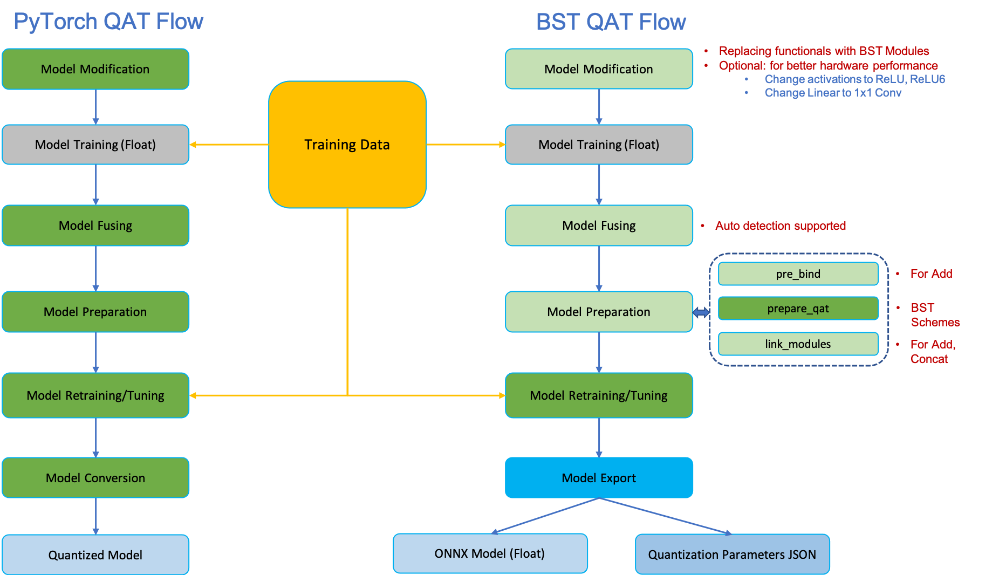

# Yolov5 Quantization Aware Training QAT

## Notes

**This repo is based on the release v7.0 of [yolov5](https://github.com/ultralytics/yolov5/).**

## 0. Prepare Environment

- This version QAT requires PyTorch version 1.9.1.
  - For YOLOv5, before install requirements.txt, please install torchvision version 0.10.1 first
    ```
    pip install torchvision==0.10.1
    pip install -r requirements.txt  
    ```

### 0.1 Create a virtual environment with PyTorch 1.9.1

```
python3 -m venv ./venv/torch1.9.1

source ~/venv/torch1.9.1/bin/activate

pip install setuptools numpy==1.23.5

pip install torch==1.9.1

pip install torchvision==0.10.1
```

### 0.2 QAT setup

- Remove the Tensorflow installation

```
install_requires.extend([
    'torch==1.9.1',
    'torchviz',
    'onnx==1.9.0',
    'onnxoptimizer==0.2.6',
    'onnxruntime-gpu==1.9.0',
    'tf2onnx==1.9.2',
    # 'tensorflow==1.15.2',
    'tqdm'
])
```

- Setup
```
pip install Cython

python setup.py develop
```

- In case there are some errors:
```
AttributeError: module 'numpy' has no attribute 'object'
```

It seems numpy 1.24.0 has some errors. Try:
```
pip install numpy==1.23.5

1 - pip uninstall -y numpy
2 - pip uninstall -y setuptools
3 - pip install setuptools
4 - pip install numpy
```

### 0.3 YOLOv5 installation
```
pip install -r requirements.txt
```

## 1 Setup

### 1.1 Clone the Sample  
```
git clone https://github.com/cshbli/yolov5_qat.git
```  

### 1.2 Dataset Preparation

Download the labels and images of coco2017, and unzip to the same level directory as the current project. 

```
Projects
├──datasets
|   └── coco                 # Directory for datasets 
│       ├── annotations
│       │   └── instances_val2017.json
│       ├── images
│       │   ├── train2017
│       │   └── val2017
│       ├── labels
│       │   ├── train2017
│       │   └── val2017
│       ├── train2017.txt
│       └── val2017.txt
└── yolov5_qat               # Quantization source code 
```

```
wget https://github.com/ultralytics/yolov5/releases/download/v1.0/coco2017labels.zip         # Download the labels needed
wget http://images.cocodataset.org/zips/train2017.zip
wget http://images.cocodataset.org/zips/val2017.zip
wget http://images.cocodataset.org/annotations/annotations_trainval2017.zip
```  

### 1.3 Download Yolov5m Pretrained Model  

```bash
$ cd /Projects/yolov5_qat
$ cd weights
$ wget https://github.com/ultralytics/yolov5/releases/download/v7.0/yolov5m.pt
$ cd ..
```  

#### Check this pretrained model accuracy

```
python val.py --weights weights/yolov5m.pt --data coco.yaml
```

Outputs: 
```
 Average Precision  (AP) @[ IoU=0.50:0.95 | area=   all | maxDets=100 ] = 0.452
 Average Precision  (AP) @[ IoU=0.50      | area=   all | maxDets=100 ] = 0.644
 Average Precision  (AP) @[ IoU=0.75      | area=   all | maxDets=100 ] = 0.489
 Average Precision  (AP) @[ IoU=0.50:0.95 | area= small | maxDets=100 ] = 0.278
 Average Precision  (AP) @[ IoU=0.50:0.95 | area=medium | maxDets=100 ] = 0.504
 Average Precision  (AP) @[ IoU=0.50:0.95 | area= large | maxDets=100 ] = 0.581
 Average Recall     (AR) @[ IoU=0.50:0.95 | area=   all | maxDets=  1 ] = 0.354
 Average Recall     (AR) @[ IoU=0.50:0.95 | area=   all | maxDets= 10 ] = 0.581
 Average Recall     (AR) @[ IoU=0.50:0.95 | area=   all | maxDets=100 ] = 0.632
 Average Recall     (AR) @[ IoU=0.50:0.95 | area= small | maxDets=100 ] = 0.451
 Average Recall     (AR) @[ IoU=0.50:0.95 | area=medium | maxDets=100 ] = 0.689
 Average Recall     (AR) @[ IoU=0.50:0.95 | area= large | maxDets=100 ] = 0.777
```

### 1.4 Replacing SiLU with ReLU

- Make sure to change the learning rate, otherwise it will long time to converge.
  - We use a new hyps yaml here [hyp.m-relu-tune.yaml](./hyp.m-relu-tune.yaml). It is based on `hyp.scratch-low.yaml`, changed lr to smaller value.
    ```
    lr0: 0.001  # initial learning rate (SGD=1E-2, Adam=1E-3), changed from 0.01
    lrf: 0.001  # final OneCycleLR learning rate (lr0 * lrf), changed from 0.01
    ...
    warmup_bias_lr: 0.01  # warmup initial bias lr, changed from 0.1
    ...
    ```
- Disable GIT info checking
- Once we changed the default_act to ReLU, we can't use auto batch size anymore. 
    - We need specifiy the `batch-size`
    - Also we can change the default `batch-size` from 16 to 64

It takes a long time to complete the retraining, please be patient.

```
python train.py --data coco.yaml --epochs 50 --weights weights/yolov5m.pt --hyp data/hyps/hyp.m-relu-tune.yaml --batch-size 64
```

```
      Epoch    GPU_mem   box_loss   obj_loss   cls_loss  Instances       Size
       0/49      6.16G    0.04115    0.06202    0.01698        150        640: 100%|██████████| 1849/1849 [51:50<00:00,  1.68s/it]
                 Class     Images  Instances          P          R      mAP50   mAP50-95: 100%|██████████| 40/40 [01:26<00:00,  2.17s/it]
                   all       5000      36335      0.701      0.557      0.609      0.416
    
      Epoch    GPU_mem   box_loss   obj_loss   cls_loss  Instances       Size
      13/49      10.2G    0.03954    0.05978    0.01563        198        640: 100%|██████████| 1849/1849 [51:32<00:00,  1.67s/it]
                 Class     Images  Instances          P          R      mAP50   mAP50-95: 100%|██████████| 40/40 [01:25<00:00,  2.13s/it]
                   all       5000      36335      0.709      0.567      0.617      0.428

      Epoch    GPU_mem   box_loss   obj_loss   cls_loss  Instances       Size
      14/49      10.2G    0.03948    0.05968    0.01557        240        640: 100%|██████████| 1849/1849 [51:30<00:00,  1.67s/it]
                 Class     Images  Instances          P          R      mAP50   mAP50-95: 100%|██████████| 40/40 [01:25<00:00,  2.13s/it]
                   all       5000      36335      0.708      0.568      0.618      0.429

      Epoch    GPU_mem   box_loss   obj_loss   cls_loss  Instances       Size
      19/49      10.2G    0.03922    0.05922    0.01519        162        640: 100%|██████████| 1849/1849 [51:23<00:00,  1.67s/it]
                 Class     Images  Instances          P          R      mAP50   mAP50-95: 100%|██████████| 40/40 [01:25<00:00,  2.13s/it]
                   all       5000      36335      0.713      0.567       0.62       0.43

      Epoch    GPU_mem   box_loss   obj_loss   cls_loss  Instances       Size
      20/49      10.2G    0.03911    0.05934    0.01513        228        640: 100%|██████████| 1849/1849 [51:33<00:00,  1.67s/it]
                 Class     Images  Instances          P          R      mAP50   mAP50-95: 100%|██████████| 40/40 [01:25<00:00,  2.13s/it]
                   all       5000      36335      0.707      0.569      0.619      0.431
```

Here is the complete retraining log file [retraining after replacing SiLU with ReLU](./notes/relu_retraining.csv).

Assuming the retraining result folder name is changed to **relu**, run validation test:

```
python val.py --weights runs/train/relu/weights/best.pt --data coco.yaml

```

We will get the following validation results: 

```
 Average Precision  (AP) @[ IoU=0.50:0.95 | area=   all | maxDets=100 ] = 0.434
 Average Precision  (AP) @[ IoU=0.50      | area=   all | maxDets=100 ] = 0.625
 Average Precision  (AP) @[ IoU=0.75      | area=   all | maxDets=100 ] = 0.468
 Average Precision  (AP) @[ IoU=0.50:0.95 | area= small | maxDets=100 ] = 0.263
 Average Precision  (AP) @[ IoU=0.50:0.95 | area=medium | maxDets=100 ] = 0.484
 Average Precision  (AP) @[ IoU=0.50:0.95 | area= large | maxDets=100 ] = 0.567
 Average Recall     (AR) @[ IoU=0.50:0.95 | area=   all | maxDets=  1 ] = 0.344
 Average Recall     (AR) @[ IoU=0.50:0.95 | area=   all | maxDets= 10 ] = 0.563
 Average Recall     (AR) @[ IoU=0.50:0.95 | area=   all | maxDets=100 ] = 0.613
 Average Recall     (AR) @[ IoU=0.50:0.95 | area= small | maxDets=100 ] = 0.437
 Average Recall     (AR) @[ IoU=0.50:0.95 | area=medium | maxDets=100 ] = 0.663
 Average Recall     (AR) @[ IoU=0.50:0.95 | area= large | maxDets=100 ] = 0.767
Results saved to runs/val/exp
```

### 1.5 Replacing SiLU with ReLU6 (Optional)

Similar as replacing SiLU with ReLU

```
python train.py --data coco.yaml --epochs 50 --weights weights/yolov5m.pt --hyp data/hyps/hyp.m-relu-tune.yaml --batch-size 64
```

Assuming the retraining result folder name is changed to **relu6**, run validation test:

```
python val.py --weights runs/train/relu6/weights/best.pt --data coco.yaml

```

We will get the following validation results: 

```
Fusing layers... 
Model summary: 212 layers, 21172173 parameters, 0 gradients, 48.9 GFLOPs
val: Scanning /home/hongbing/Projects/datasets/coco/val2017.cache... 4952 images, 48 backgrounds, 0 corrupt: 100%|██████████| 5000/5000 [00:00<?, ?it/s]
                 Class     Images  Instances          P          R      mAP50   mAP50-95: 100%|██████████| 157/157 [01:15<00:00,  2.07it/s]
                   all       5000      36335      0.701      0.563      0.615      0.428
Speed: 0.1ms pre-process, 10.1ms inference, 0.9ms NMS per image at shape (32, 3, 640, 640)

Evaluating pycocotools mAP... saving runs/val/exp3/best_predictions.json...
loading annotations into memory...
Done (t=0.29s)
creating index...
index created!
Loading and preparing results...
DONE (t=3.26s)
creating index...
index created!
Running per image evaluation...
Evaluate annotation type *bbox*
DONE (t=46.18s).
Accumulating evaluation results...
DONE (t=10.45s).
 Average Precision  (AP) @[ IoU=0.50:0.95 | area=   all | maxDets=100 ] = 0.431
 Average Precision  (AP) @[ IoU=0.50      | area=   all | maxDets=100 ] = 0.621
 Average Precision  (AP) @[ IoU=0.75      | area=   all | maxDets=100 ] = 0.467
 Average Precision  (AP) @[ IoU=0.50:0.95 | area= small | maxDets=100 ] = 0.260
 Average Precision  (AP) @[ IoU=0.50:0.95 | area=medium | maxDets=100 ] = 0.484
 Average Precision  (AP) @[ IoU=0.50:0.95 | area= large | maxDets=100 ] = 0.559
 Average Recall     (AR) @[ IoU=0.50:0.95 | area=   all | maxDets=  1 ] = 0.344
 Average Recall     (AR) @[ IoU=0.50:0.95 | area=   all | maxDets= 10 ] = 0.563
 Average Recall     (AR) @[ IoU=0.50:0.95 | area=   all | maxDets=100 ] = 0.612
 Average Recall     (AR) @[ IoU=0.50:0.95 | area= small | maxDets=100 ] = 0.427
 Average Recall     (AR) @[ IoU=0.50:0.95 | area=medium | maxDets=100 ] = 0.667
 Average Recall     (AR) @[ IoU=0.50:0.95 | area= large | maxDets=100 ] = 0.763
```

### 1.6 Code changes

Please refer to all related code changes here [code change log](./notes/bst_code_changes.md).

## 2. QAT

BST QAT flow chart:



### Model fusing debug and pre-bind debug

We can turn on the `debug_mode=True` to print out the model structure while doing `fuse_modules`.

```
# use CPU on input_tensor as our backend for parsing GraphTopology forced model to be on CPU    
model = quantizer.fuse_modules(model, auto_detect=True, debug_mode=False, input_tensor=sample_data.to('cpu'))
```

The example [fuse modules pdf printout](./notes/fuse_modules_debug.gv.pdf).

We can turn on the `debug_mode=True` to print out the model structure while doing `pre_bind`.

```
# 1) [bst_alignment] get b0 pre-bind qconfig adjusting Conv's activation quant scheme
pre_bind_qconfig = quantizer.pre_bind(model, input_tensor=sample_data.to('cpu'), debug_mode=False,
    observer_scheme_dict={"weight_scheme": "MovingAveragePerChannelMinMaxObserver", 
                          "activation_scheme": "MovingAverageMinMaxObserver"})
```

The example [pre-bind pdf printout](./notes/pre_bind_debug.gv.pdf).


### Experiment 1: Quantization with Conv+BN+ReLU, skip_add and Concat

- QAT can't use multiple GPUs. We need to specify the device ID.
- Please see the quantized model structure here: [Quantized mode structure](./notes/bst_qat_model.txt)

- Stop observers after epoch 0.
- Power of 2 scale with rounding. 

```
python train.py --data coco.yaml --epochs 20 --cfg models/yolov5m.yaml \
--weights runs/train/relu/weights/best.pt --hyp data/hyps/hyp.m-relu-tune.yaml \
--batch-size 32 --qat --device 1
```

Result log: 

```
Starting training for 20 epochs...

      Epoch    GPU_mem   box_loss   obj_loss   cls_loss  Instances       Size       
       0/19        15G     0.0431    0.05806     0.0141        199        640: 100%|██████████| 3697/3697 [1:08:30<00:00,  1.11s/it]
                 Class     Images  Instances          P          R      mAP50   mAP50-95: 100%|██████████| 79/79 [02:11<00:00,  1.67s/it]
                   all       5000      36335      0.677      0.538      0.584      0.369

      Epoch    GPU_mem   box_loss   obj_loss   cls_loss  Instances       Size
       1/19      16.8G     0.0429    0.05798    0.01391        169        640: 100%|██████████| 3697/3697 [58:17<00:00,  1.06it/s] 
                 Class     Images  Instances          P          R      mAP50   mAP50-95: 100%|██████████| 79/79 [02:11<00:00,  1.66s/it]
                   all       5000      36335      0.684      0.552      0.595       0.38
      
      Epoch    GPU_mem   box_loss   obj_loss   cls_loss  Instances       Size      
      18/19      18.2G    0.04176    0.05679    0.01283        216        640: 100%|██████████| 3697/3697 [36:50<00:00,  1.67it/s]
                 Class     Images  Instances          P          R      mAP50   mAP50-95: 100%|██████████| 79/79 [01:00<00:00,  1.32it/s]
                   all       5000      36335      0.686      0.555        0.6      0.387

      Epoch    GPU_mem   box_loss   obj_loss   cls_loss  Instances       Size      
      19/19      18.2G    0.04173    0.05679    0.01279        198        640: 100%|██████████| 3697/3697 [36:33<00:00,  1.69it/s]
                 Class     Images  Instances          P          R      mAP50   mAP50-95: 100%|██████████| 79/79 [01:00<00:00,  1.31it/s]
                   all       5000      36335      0.686      0.556      0.602       0.39
```

### Experiment 2: Quantization with full pipeline, Conv+BN+ReLU, skip_add and Concat, and alignment

- QAT can't use multiple GPUs. We need to specify the device ID.
- Please see the quantized model structure here: [Quantized mode structure](./notes/bst_qat_model.txt)

- Stop observers after epoch 0, free batch norm after epoch 0
- Power of 2 scale with rounding. 

```
python train.py --data coco.yaml --epochs 20 --cfg models/yolov5m.yaml \
--weights runs/train/relu/weights/best.pt --hyp data/hyps/hyp.m-relu-tune.yaml \
--batch-size 32 --qat --device 1
```

Result log: 

```
Starting training for 20 epochs...

      Epoch    GPU_mem   box_loss   obj_loss   cls_loss  Instances       Size       
       0/19      14.6G    0.04198    0.05757     0.0138        199        640: 100%|██████████| 3697/3697 [37:51<00:00,  1.63it/s]
                 Class     Images  Instances          P          R      mAP50   mAP50-95: 100%|██████████| 79/79 [01:02<00:00,  1.26it/s
                   all       5000      36335      0.691      0.551      0.598      0.387
                   
      Epoch    GPU_mem   box_loss   obj_loss   cls_loss  Instances       Size       
       1/19      23.1G     0.0422    0.05728    0.01337        169        640: 100%|██████████| 3697/3697 [36:44<00:00,  1.68it/s]
                 Class     Images  Instances          P          R      mAP50   mAP50-95: 100%|██████████| 79/79 [01:00<00:00,  1.30it/s]
                   all       5000      36335      0.693      0.546      0.599      0.381

      Epoch    GPU_mem   box_loss   obj_loss   cls_loss  Instances       Size       
       2/19      23.1G    0.04257    0.05747    0.01341        144        640: 100%|██████████| 3697/3697 [36:40<00:00,  1.68it/s]
                 Class     Images  Instances          P          R      mAP50   mAP50-95: 100%|██████████| 79/79 [01:01<00:00,  1.29
                   all       5000      36335       0.68      0.545       0.59      0.372

      Epoch    GPU_mem   box_loss   obj_loss   cls_loss  Instances       Size
       3/19      23.1G     0.0426    0.05772    0.01357        149        640: 100%|██████████| 3697/3697 [36:38<00:00,  1.68it/s]
                 Class     Images  Instances          P          R      mAP50   mAP50-95: 100%|██████████| 79/79 [01:00<00:00,  1.30
                   all       5000      36335      0.684      0.547      0.595      0.375

      Epoch    GPU_mem   box_loss   obj_loss   cls_loss  Instances       Size       
       4/19      23.1G    0.04255    0.05764    0.01357        197        640: 100%|██████████| 3697/3697 [36:40<00:00,  1.68it/s]
                 Class     Images  Instances          P          R      mAP50   mAP50-95: 100%|██████████| 79/79 [01:01<00:00,  1.29
                   all       5000      36335      0.693      0.543      0.595       0.38
      
      Epoch    GPU_mem   box_loss   obj_loss   cls_loss  Instances       Size
      10/19      23.1G    0.04202    0.05711    0.01304        180        640: 100%|██████████| 3697/3697 [36:35<00:00,  1.68it/s]
                 Class     Images  Instances          P          R      mAP50   mAP50-95: 100%|██████████| 79/79 [01:01<00:00,  1.29
                   all       5000      36335      0.687      0.556      0.602      0.387

      Epoch    GPU_mem   box_loss   obj_loss   cls_loss  Instances       Size
      13/19      23.1G    0.04181    0.05672    0.01283        198        640: 100%|██████████| 3697/3697 [36:30<00:00,  1.69it/s]
                 Class     Images  Instances          P          R      mAP50   mAP50-95: 100%|██████████| 79/79 [01:00<00:00,  1.30
                   all       5000      36335      0.686      0.553        0.6      0.389
                   
      Epoch    GPU_mem   box_loss   obj_loss   cls_loss  Instances       Size
      15/19      23.1G    0.04173    0.05668    0.01279        183        640: 100%|██████████| 3697/3697 [36:37<00:00,  1.68it/s]
                 Class     Images  Instances          P          R      mAP50   mAP50-95: 100%|██████████| 79/79 [01:00<00:00,  1.30
                   all       5000      36335      0.702      0.552      0.604      0.391
      
      Epoch    GPU_mem   box_loss   obj_loss   cls_loss  Instances       Size
      16/19      23.1G    0.04159    0.05661    0.01271        228        640: 100%|██████████| 3697/3697 [36:35<00:00,  1.68it/s]
                 Class     Images  Instances          P          R      mAP50   mAP50-95: 100%|██████████| 79/79 [01:00<00:00,  1.30
                   all       5000      36335        0.7      0.548      0.601      0.386

      Epoch    GPU_mem   box_loss   obj_loss   cls_loss  Instances       Size
      17/19      23.1G    0.04152    0.05646    0.01263        176        640: 100%|██████████| 3697/3697 [36:30<00:00,  1.69it/s]
                 Class     Images  Instances          P          R      mAP50   mAP50-95: 100%|██████████| 79/79 [01:00<00:00,  1.30
                   all       5000      36335      0.696      0.553      0.602      0.393
      
      Epoch    GPU_mem   box_loss   obj_loss   cls_loss  Instances       Size
      18/19      23.1G    0.04144    0.05639    0.01257        216        640: 100%|██████████| 3697/3697 [36:38<00:00,  1.68it/s]
                 Class     Images  Instances          P          R      mAP50   mAP50-95: 100%|██████████| 79/79 [01:00<00:00,  1.30
                   all       5000      36335      0.684       0.56      0.602       0.39

      Epoch    GPU_mem   box_loss   obj_loss   cls_loss  Instances       Size
      19/19      23.1G    0.04138    0.05634     0.0125        198        640: 100%|██████████| 3697/3697 [36:37<00:00,  1.68it/s]
                 Class     Images  Instances          P          R      mAP50   mAP50-95: 100%|██████████| 79/79 [01:00<00:00,  1.30
                   all       5000      36335      0.701      0.555      0.606      0.394
```

### Experiment 3: Quantization with full pipeline, Conv+BN+ReLU, skip_add and Concat, and alignment

- Same as Experiment 2, but with more epochs
- Model collapsed

```
python train.py --data coco.yaml --epochs 100 --cfg models/yolov5m.yaml \
--weights runs/train/relu/weights/best.pt --hyp data/hyps/hyp.m-relu-tune.yaml \
--batch-size 32 --qat --device 2
```

Result log: 

```
Starting training for 100 epochs...

      Epoch    GPU_mem   box_loss   obj_loss   cls_loss  Instances       Size       
       0/19      14.6G    0.04198    0.05757     0.0138        199        640: 100%|██████████| 3697/3697 [37:51<00:00,  1.63it/s]
                 Class     Images  Instances          P          R      mAP50   mAP50-95: 100%|██████████| 79/79 [01:02<00:00,  1.26it/s
                   all       5000      36335      0.691      0.551      0.598      0.387
                   
      Epoch    GPU_mem   box_loss   obj_loss   cls_loss  Instances       Size
      32/99      23.3G    0.04298    0.05868    0.01414        177        640: 100%|██████████| 3697/3697 [37:13<00:00,  1.66it/s]
                 Class     Images  Instances          P          R      mAP50   mAP50-95: 100%|██████████| 79/79 [01:02<00:00,  1.26it/s]
                   all       5000      36335      0.687      0.535      0.586      0.376

      Epoch    GPU_mem   box_loss   obj_loss   cls_loss  Instances       Size      
      33/99      23.3G    0.05581    0.06695    0.03414        180        640: 100%|██████████| 3697/3697 [37:15<00:00,  1.65it/s]
                 Class     Images  Instances          P          R      mAP50   mAP50-95: 100%|██████████| 79/79 [02:11<00:00,  1.67s/it]
                   all       5000      36335   3.84e-05     0.0026   2.18e-05   6.22e-06

      Epoch    GPU_mem   box_loss   obj_loss   cls_loss  Instances       Size
      34/99      23.3G     0.1017    0.09084     0.1002        175        640: 100%|██████████| 3697/3697 [36:59<00:00,  1.67it/s]
                 Class     Images  Instances          P          R      mAP50   mAP50-95: 100%|██████████| 79/79 [01:26<00:00,  1.10s/it]
                   all       5000      36335    4.7e-05    0.00197   2.77e-05   7.73e-06

      Epoch    GPU_mem   box_loss   obj_loss   cls_loss  Instances       Size
      35/99      23.3G    0.09932    0.08901    0.09485        173        640: 100%|██████████| 3697/3697 [36:58<00:00,  1.67it/s]
                 Class     Images  Instances          P          R      mAP50   mAP50-95: 100%|██████████| 79/79 [01:04<00:00,  1.22it/s]
                   all       5000      36335   2.38e-05    0.00206   1.34e-05   4.05e-06

      Epoch    GPU_mem   box_loss   obj_loss   cls_loss  Instances       Size
      36/99      23.3G    0.09783    0.08883    0.09386        198        640: 100%|██████████| 3697/3697 [37:01<00:00,  1.66it/s]
                 Class     Images  Instances          P          R      mAP50   mAP50-95: 100%|██████████| 79/79 [01:00<00:00,  1.30it/s]
                   all       5000      36335    2.4e-05    0.00171   1.43e-05   4.32e-06
```
