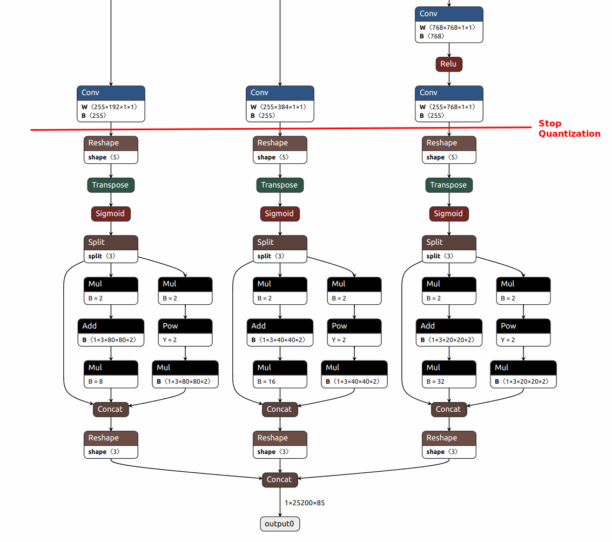

# Code changes

## 1. common.py

### 1.0 Import necessary package

```
from bstnnx_training.PyTorch.QAT import modules as bstnn
# We are going to replace Concat module with BstConcat. QAT will quantize BstConcat
from bstnnx_training.PyTorch.QAT.modules import BstConcat 
```

### 1.1 Replacing SiLU with ReLU

- ReLU can be fused into Conv. It is processed by MACA. SiLU is processed by EDP. ReLU has better performance on FPS.

```
class Conv(nn.Module):
    # Standard convolution with args(ch_in, ch_out, kernel, stride, padding, groups, dilation, activation)
    # default_act = nn.SiLU()  # default activation

    def __init__(self, c1, c2, k=1, s=1, p=None, g=1, d=1, act=True):
        super().__init__()
        self.conv = nn.Conv2d(c1, c2, k, s, autopad(k, p, d), groups=g, dilation=d, bias=False)
        self.bn = nn.BatchNorm2d(c2)
        # self.act = self.default_act if act is True else act if isinstance(act, nn.Module) else nn.Identity()
        self.act = nn.ReLU() if act is True else act if isinstance(act, nn.Module) else nn.Identity()
        # self.act = nn.ReLU6() if act is True else act if isinstance(act, nn.Module) else nn.Identity()
```  

### 1.2 Replacing functional add with bstnn.Add module

```
class Bottleneck(nn.Module):
    # Standard bottleneck
    def __init__(self, c1, c2, shortcut=True, g=1, e=0.5):  # ch_in, ch_out, shortcut, groups, expansion
        super().__init__()
        c_ = int(c2 * e)  # hidden channels
        self.cv1 = Conv(c1, c_, 1, 1)
        self.cv2 = Conv(c_, c2, 3, 1, g=g)
        self.add = shortcut and c1 == c2

        self.skip_add = bstnn.Add()

    def forward(self, x):
        # return x + self.cv2(self.cv1(x)) if self.add else self.cv2(self.cv1(x))
        return self.skip_add(x, self.cv2(self.cv1(x))) if self.add else self.cv2(self.cv1(x))
```

### 1.3 Replacing torch.cat functional with bstnn.CatChannel module

```
class C3(nn.Module):
    # CSP Bottleneck with 3 convolutions
    def __init__(self, c1, c2, n=1, shortcut=True, g=1, e=0.5):  # ch_in, ch_out, number, shortcut, groups, expansion
        super().__init__()
        c_ = int(c2 * e)  # hidden channels
        self.cv1 = Conv(c1, c_, 1, 1)
        self.cv2 = Conv(c1, c_, 1, 1)
        self.cv3 = Conv(2 * c_, c2, 1)  # optional act=FReLU(c2)
        self.m = nn.Sequential(*(Bottleneck(c_, c_, shortcut, g, e=1.0) for _ in range(n)))
        self.concat = bstnn.CatChannel()

    def forward(self, x):
        # return self.cv3(torch.cat((self.m(self.cv1(x)), self.cv2(x)), 1))
        return self.cv3(self.concat(self.m(self.cv1(x)), self.cv2(x)))
```        

```class SPPF(nn.Module):
    # Spatial Pyramid Pooling - Fast (SPPF) layer for YOLOv5 by Glenn Jocher
    def __init__(self, c1, c2, k=5):  # equivalent to SPP(k=(5, 9, 13))
        super().__init__()
        c_ = c1 // 2  # hidden channels
        self.cv1 = Conv(c1, c_, 1, 1)
        self.cv2 = Conv(c_ * 4, c2, 1, 1)
        self.m = nn.MaxPool2d(kernel_size=k, stride=1, padding=k // 2)
        self.concat = bstnn.CatChannel()

    def forward(self, x):
        x = self.cv1(x)
        with warnings.catch_warnings():
            warnings.simplefilter('ignore')  # suppress torch 1.9.0 max_pool2d() warning
            y1 = self.m(x)
            y2 = self.m(y1)
            # return self.cv2(torch.cat((x, y1, y2, self.m(y2)), 1))
            return self.cv2(self.concat(x, y1, y2, self.m(y2)))
```

### 1.4 Replacing Concat module with bstnn.BstConcat module

- This is the most confusing part. It caused lots of trouble. It requires QAT softmare to make related changes also.
  - bstnn.CatChannel with multiple tensors as inputs
  - bstnn.BstConcat with one tensor list as the input.


```
# bstnn.CatChannel takes multiple tensors as inputs
# bstnn.BstConcat takes one tensor array as the input
# We can't reuse bstnn.CatChannel here and have to redefine another module in QAT software package
Concat = BstConcat

# class Concat(nn.Module):
#     # Concatenate a list of tensors along dimension
#     def __init__(self, dimension=1):
#         super().__init__()
#         self.d = dimension

#     def forward(self, x):
#         return torch.cat(x, self.d)
```

## 2 yolo.py

### 2.0 Import packages

```
import torch.quantization as quantizer
```

### 2.1 Add QuantStub

- Set the quantization starting point at the beginning of the model

```
class DetectionModel(BaseModel):
    # YOLOv5 detection model
    def __init__(self, cfg='yolov5s.yaml', ch=3, nc=None, anchors=None):  # model, input channels, number of classes
        super().__init__()
        if isinstance(cfg, dict):
            self.yaml = cfg  # model dict
        else:  # is *.yaml
            import yaml  # for torch hub
            self.yaml_file = Path(cfg).name
            with open(cfg, encoding='ascii', errors='ignore') as f:
                self.yaml = yaml.safe_load(f)  # model dict

        # Define model
        ch = self.yaml['ch'] = self.yaml.get('ch', ch)  # input channels
        if nc and nc != self.yaml['nc']:
            LOGGER.info(f"Overriding model.yaml nc={self.yaml['nc']} with nc={nc}")
            self.yaml['nc'] = nc  # override yaml value
        if anchors:
            LOGGER.info(f'Overriding model.yaml anchors with anchors={anchors}')
            self.yaml['anchors'] = round(anchors)  # override yaml value
        self.model, self.save = parse_model(deepcopy(self.yaml), ch=[ch])  # model, savelist
        self.names = [str(i) for i in range(self.yaml['nc'])]  # default names
        self.inplace = self.yaml.get('inplace', True)

        self.quant = quantizer.QuantStub()

        # Build strides, anchors
        m = self.model[-1]  # Detect()
        if isinstance(m, (Detect, Segment)):
            s = 256  # 2x min stride
            m.inplace = self.inplace
            forward = lambda x: self.forward(x)[0] if isinstance(m, Segment) else self.forward(x)
            m.stride = torch.tensor([s / x.shape[-2] for x in forward(torch.zeros(1, ch, s, s))])  # forward
            check_anchor_order(m)
            m.anchors /= m.stride.view(-1, 1, 1)
            self.stride = m.stride
            self._initialize_biases()  # only run once

        # Init weights, biases
        initialize_weights(self)
        self.info()
        LOGGER.info('')

    def forward(self, x, augment=False, profile=False, visualize=False):

        x = self.quant(x)

        if augment:
            return self._forward_augment(x)  # augmented inference, None
        return self._forward_once(x, profile, visualize)  # single-scale inference, train
```

### 2.2 Add DeQuantStub

- We are not going to do QAT for the last several layers. Thoese layers will be processed by DSP.
- Since there are three outputs, we need three different dequant functions to differentiate them.



```
class Detect(nn.Module):
    # YOLOv5 Detect head for detection models
    stride = None  # strides computed during build
    dynamic = False  # force grid reconstruction
    export = False  # export mode

    def __init__(self, nc=80, anchors=(), ch=(), inplace=True):  # detection layer
        super().__init__()
        self.nc = nc  # number of classes
        self.no = nc + 5  # number of outputs per anchor
        self.nl = len(anchors)  # number of detection layers
        self.na = len(anchors[0]) // 2  # number of anchors
        self.grid = [torch.empty(0) for _ in range(self.nl)]  # init grid
        self.anchor_grid = [torch.empty(0) for _ in range(self.nl)]  # init anchor grid
        self.register_buffer('anchors', torch.tensor(anchors).float().view(self.nl, -1, 2))  # shape(nl,na,2)
        self.m = nn.ModuleList(nn.Conv2d(x, self.no * self.na, 1) for x in ch)  # output conv
        self.inplace = inplace  # use inplace ops (e.g. slice assignment)

        self.dequant0 = quantizer.DeQuantStub()
        self.dequant1 = quantizer.DeQuantStub()
        self.dequant2 = quantizer.DeQuantStub()

    def forward(self, x):
        z = []  # inference output
        for i in range(self.nl):
            x[i] = self.m[i](x[i])  # conv

            if i == 0:
                x[i] = self.dequant0(x[i])
            elif i == 1:
                x[i] = self.dequant1(x[i])
            elif i == 2:
                x[i] = self.dequant2(x[i])

            bs, _, ny, nx = x[i].shape  # x(bs,255,20,20) to x(bs,3,20,20,85)
            x[i] = x[i].view(bs, self.na, self.no, ny, nx).permute(0, 1, 3, 4, 2).contiguous()

            if not self.training:  # inference
                if self.dynamic or self.grid[i].shape[2:4] != x[i].shape[2:4]:
                    self.grid[i], self.anchor_grid[i] = self._make_grid(nx, ny, i)

                if isinstance(self, Segment):  # (boxes + masks)
                    xy, wh, conf, mask = x[i].split((2, 2, self.nc + 1, self.no - self.nc - 5), 4)
                    xy = (xy.sigmoid() * 2 + self.grid[i]) * self.stride[i]  # xy
                    wh = (wh.sigmoid() * 2) ** 2 * self.anchor_grid[i]  # wh
                    y = torch.cat((xy, wh, conf.sigmoid(), mask), 4)
                else:  # Detect (boxes only)
                    xy, wh, conf = x[i].sigmoid().split((2, 2, self.nc + 1), 4)
                    xy = (xy * 2 + self.grid[i]) * self.stride[i]  # xy
                    wh = (wh * 2) ** 2 * self.anchor_grid[i]  # wh
                    y = torch.cat((xy, wh, conf), 4)
                z.append(y.view(bs, self.na * nx * ny, self.no))

        return x if self.training else (torch.cat(z, 1),) if self.export else (torch.cat(z, 1), x)
```